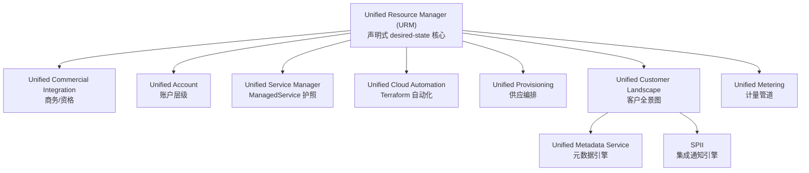

# 🏠 BTP Unified Services (Atom) 文档集 — 总索引

> [!info] 关于本文档集
> 本文档集是对 SAP 内部文档站 **BTP UNIFIED SERVICES DOCUMENTATION**（内部代号 **Atom**，来源仓库 `atom-cfs/atom-docs`）的完整中文整理，供导入 Obsidian 使用。
> - 所有笔记通过 `[[双链]]` 互相连接，可用「关系图谱（Graph View）」浏览。
> - 保留了全部英文术语原文、资源类型名、`apiVersion`、字段名与枚举值。
> - 一句话定位：**把 SAP 各条商业解决方案和流程整合进单一产品套件 —— ONE SAP experience。**

## 🚀 从这里开始

- [[什么是 Unified Services]] — 先读这篇，理解产品是什么
- [[整体架构]] — URM 为核心的架构全景
- [[术语表与缩写]] — 随时查缩写
- [[核心概念关系总览]] — 所有资源/组件如何串起来

## 🧭 分区导航

### 01 概览
- [[什么是 Unified Services]]
- [[动机与背景 (IES 战略)]]
- [[基本原理 (Fundamentals)]]
- [[整体架构]]

### 02 核心概念（Product Concepts）
- [[Unified Resource Manager (URM)]] — 声明式核心
- [[Unified Service Manager 与 ManagedService]] — 应用"护照"
- [[Accounts 账户模型]]
- [[Unified Commercial Integration (UCI)]] — 商务集成
- [[Unified Metering 计量]]
- [[Unified Provisioning 供应]]
- [[Unified Customer Landscape (UCL)]] — 客户全景
- [[SPII 服务提供方集成接口]] — 集成通知引擎
- [[Formations 编排组]]
- [[Embedded Tenants 嵌入式租户]]
- [[Unified Cloud Automation (UCA)]]
- [[SCI 身份与安全]]

### 03 参考手册 — 资源类型（Reference Guide）
- [[资源模型通用约定]]
- [[账户层级资源]]
- [[系统资源 (TechnicalClient-Secret-RTD)]]
- [[ManagedService v2 参考]]
- [[商业化集成资源 (Eligibility 等)]]
- [[供应资源 (SPFI-FulfillmentData-Solution)]]
- [[BTP Blueprint 与解决方案]]
- [[Cloud Automation 资源]]
- [[Customer Landscape 资源 (MAP 等)]]
- [[计量资源]]
- [[嵌入式租户资源]]
- [[遥测与中央通信服务]]
- [[已弃用资源]]

### 04 安全与授权（Security Aspects）
- [[授权模型 (Role-Binding-PathBinding)]]
- [[系统交付角色]]
- [[数据保护与隐私]]

### 05 操作指南（Getting Started + How-To）
- [[入门-申请 Provider Folder]]
- [[入门-快速向导创建 App]]
- [[入门-管理用户授权]]
- [[入门-应用运营模式]]
- [[入门-分阶段开发 (Staged Development)]]
- [[How-To 集成你的应用]]
- [[How-To 供应与迁移到 URM]]
- [[How-To 其他任务]]

### 06 工具（Atom Tools）
- [[uctl 命令行工具]]
- [[Ubuilder 脚手架]]
- [[URM Studio (VS Code 扩展)]]
- [[UPC 统一提供方驾驶舱]]
- [[Workspace 与 CAD]]
- [[其他工具与 SDK]]

### 07 业务场景（Business Use Cases）
- [[业务场景总览]]

### 99 附录
- [[术语表与缩写]]
- [[核心概念关系总览]]
- [[Landscapes 环境]]
- [[附录-支持渠道与变更管理]]
- [[附录-What's New 更新历史]]
- [[附录-PLD 产品景观设计器]]
- [[开发-为你的应用开发 Operator]]

## 🗺️ 架构速览

> [!note] 数据来源
> 内容整理自 `https://pages.github.tools.sap/atom-cfs/atom-docs/docs/`（需 SAP 内网 + 认证访问）。本文档集为中文摘要与结构化重组，非逐字翻译。
