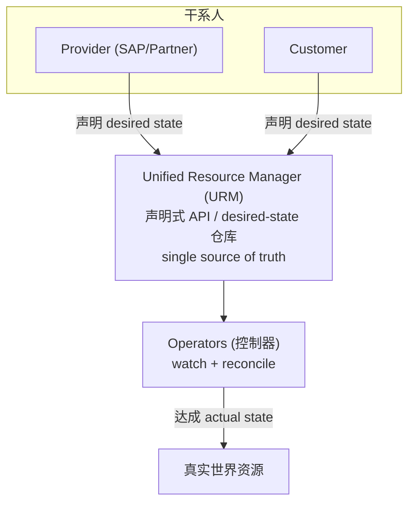

# 整体架构

> [!abstract] 核心
> Unified Services 的中心在逻辑上是一个 **singleton(单例)**,负责管理和编排由 SAP、伙伴、客户提供与消费的服务(和应用)生态。其心脏是 [[Unified Resource Manager (URM)]] —— 呈现一个**声明式 API**,所有 operator 用 **operator 模式**观测声明请求(desired state)并采取动作去达成(actual state)。

## 高层架构

Unified Services 让内容提供方发布资源供他人消费,处理:
- 商业关系(commercial relationships)
- 物理供应编排(physical provisioning orchestration)
- 消费方与提供方之间的安全通信(经 Service Mesh 或 Internet)
- 客户组织与管理其 IT landscape

## 主要组件

| 组件 | 说明 |
|------|------|
| **Unified Resource Manager** | desired-state 仓库 + 声明式 API 范式;消费基础服务的入口,提供跨 SAP(不限 BTP)的可扩展标准化交互 |
| **Unified Commercial Integration** | 管理客户使用产品的资格(eligibility)生命周期,并让 provider 定义其服务 |
| **Unified Account** | 管理承载全部 SAP 相关商业/技术/安全/连接资产的上下文配置空间 |
| **Unified Service Manager** | 管理跨 SAP 所有服务的生命周期,让 provider 注册发布、consumer 供应(考虑合同资格、剩余配额、托管分配) |
| **Unified Cloud Automation** | 基于 SAP BTP Cloud Automation,让 provider 自动化其应用与服务的供应配置 |
| **Unified Provisioning** | 让 SAP/伙伴方案实现各自的供应与租户接入流程,由客户在 SAP for Me 激活购买的方案触发 |
| **Unified Customer Landscape** | 一组服务,让客户与 provider 发现聚合整合的机器可读 IT landscape 视图,连接 SAP 应用租户并启用集成 |
| **Unified Solution Manager** | 让方案定义描述其租户接入流程的 blueprint,及使客户能激活购买方案的 solution 定义 |

## 三大架构原则

### 1. URM 作为组件的地基
[[Unified Resource Manager (URM)|URM]] 是声明与协调 SAP 云资源 desired state 的中心化基础设施 —— 单一声明式 API 端点。核心概念:URM 中心化管理资源及其状态(desired 与 actual);控制器(controllers)watch 变化并把真实世界向 desired state 收敛;URM 成为 desired state 与 status 的 **single source of truth**。

### 2. 组件即 URM operator
**Unified Commercial Integration、Unified Account、Unified Service Manager** 等组件都实现为 **URM operator**(带控制循环的控制器,可选带 webhook)。operator 的能力:
- 通过引入新的 **Resource Type Definitions (RTDs)** 扩展 URM API,并设控制器 watch 资源变化。
- 以 Role/Binding 形式细粒度管理访问控制(可到单个资源)。
- 检测 desired state 变化并采取动作达成。
- 多个 operator 可 watch 同一资源并各自响应、附加信息。
- 提供 filters / webhook 机制对资源做 mutate 与 validate。
- 数据可分布于不同地理位置以符合合规。

### 3. UMS 用于发现图状元数据
[[Unified Customer Landscape (UCL)#UMS 元数据服务|Unified Metadata Service (UMS)]] 提供可插拔架构,各元数据类型 owner 提供 plugin 聚合/联邦数据。典型用例是构建在 UMS 之上的 **Unified Landscape Model (ULM)**。

## 外部系统集成

| 外部系统 | Canary | Live |
|----------|--------|------|
| SAP for Me | Test | Stage / Canary / Factory |
| CRM | ICT | ICP |
| CLD/SLIS | VLAB | Prod |
| CM/CC | C2T | C2P |
| BTP | Canary | Live |

## 相关

- [[什么是 Unified Services]]
- [[Unified Resource Manager (URM)]]
- [[核心概念关系总览]]
- [[Landscapes 环境]]
