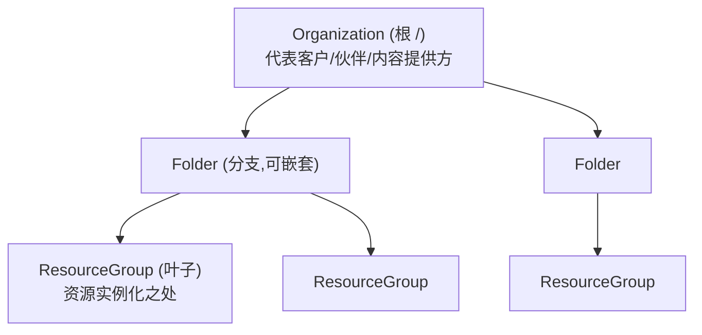

# Accounts 账户模型

> [!abstract] 核心
> **Unified Account (UA)** 为 SAP 客户(如 "One SAP Account")和内容/服务提供方(如 "provider folders")提供**上下文配置空间**,承载跨 LOB 的商务、技术、安全、连通性资产。它通过灵活的层级结构,让 provider 与 consumer 按运营方定义的商业规则与策略,以层级化方式管理提供与合规的资源。

## 数据模型:层级结构

| 实体 | 说明 |
|------|------|
| **Organization** | 基础实体,代表一个客户/内容提供方/伙伴,关联合同与商务关系。只能建在根 `path: /` |
| **Folder** | 树的分支,构建层级;可嵌套;单一父 |
| **Resource Group** | 树的叶子,把相关资源(如 managed services)分组作为一个单元消费;**资源类型只能在此实例化** |

## 关键机制

- 层级可管理**策略配置**和**产品分配**。
- 可**委派/分配所有权**。
- 产品 **Entitlements** 通过策略资源 [[商业化集成资源 (Eligibility 等)#PathBinding via Eligibility|PathBinding]] 在层级中分发。
- **AccountMetadata**:只读,提供上下文(标识、租户分离、成本计算),沿层级向下继承。

## 与其他概念的关系

- 与 [[Unified Commercial Integration (UCI)]] 紧密关联:entitlement → eligibility → quota 都落在账户层级里。
- 与 [[Unified Service Manager 与 ManagedService|ManagedService]] 关联:服务发布与消费都在账户层级上下文中。

## 参考

各资源(`Organization`、`OrganizationBase`、`Folder`、`ResourceGroup`、`AccountMetadata`、`AccountTenantGroup`)的详细字段与 API Extensions,见 [[账户层级资源]]。

## 相关

- [[账户层级资源]]
- [[授权模型 (Role-Binding-PathBinding)]]
- [[入门-申请 Provider Folder]]
- [[Unified Commercial Integration (UCI)]]
