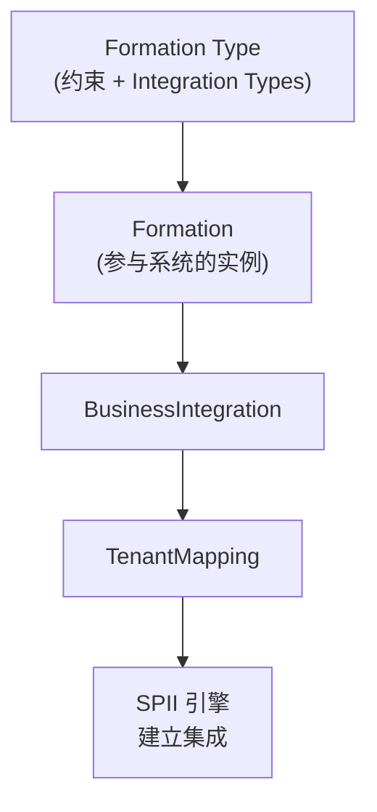

# Formations 编排组

> [!abstract] 核心
> **Formation** 是把 SAP/第三方系统按特定业务目的分组的逻辑集合(一个 integration scenario),由所选 **Formation Type** 定义;创建后自动建立参与系统间的集成。核心引擎是 [[SPII 服务提供方集成接口|SPII]] notification engine。**仅面向有 BTP SKU / BTP global account 的客户。**

## Formation Type(格式类型)

对客户是**元数据**,实则含所有约束:

- **Cardinality & Selection Constraints**:哪些 system type 可参与、区域共置、单例约束等。
- **Integration Types**:成对 System Type 间可复用的 design-time 集成定义,含 **Initiator System Type**(Wave 0 首个收到通知的一侧)、Facilitators 参与方式。
- 额外用户自定义 integration inputs schema。
- **Related Formation Types**:依赖关系。

### 两类 Formation Type

| 类型 | 说明 |
|------|------|
| **Scenario Specific** | 围绕单一 leading app / 业务流程 |
| **Shared Service** | 围绕被多方复用的共享服务(如 SAP Master Data Integration) |

前者常依赖后者 —— 高层自动化(BTPSolution/Booster)会先建 shared service formation。

## Formation Status(4 种)

| 状态 | 说明 |
|------|------|
| **Ready** | 就绪 |
| **Action Required** | 未完全配置(如需 Kyma 环境实例) |
| **Synchronizing** | 同步中 |
| **Error** | 错误 |

**Resynchronize**:仅重放当前失败/未答复的 assignment,双方解耦独立恢复。

## 与 Integration / Solution 的关系

- **BTP PaaS 客户**:建 Formation → 建 Business Integration + tenant mappings。
- **SaaS 客户**:call-off `Solution` → 分解为 tenant 资源 + business integrations。

## 自助 UI(Formation Type UI)

在 **BTP Cockpit → System Landscape → Formations**,切 **Service Owner View**,出现 **Integration Types** / **Formation Types** 标签。

- **所有权模型**:创建所在 Global Account 为 owner(仅 owner 可编辑/删除)。
- **Step 1 建 Integration Type**:选两个 System Type + Initiator;可选 Use Facilitators(Pre/Post、Mode、chained 用 Priority 排序)。
- **Step 2 建 Formation Type**:Name、Supported/Leading/Required System Types、ORD Consumers、Reset&Resync、依赖关系;可选 Support Component(上线必填)、Product Suites。

> 详细操作见 [[How-To 集成你的应用#Formation Type 自助 UI]]。

## 相关

- [[Unified Customer Landscape (UCL)]]
- [[SPII 服务提供方集成接口]]
- [[How-To 集成你的应用]]
- [[Customer Landscape 资源 (MAP 等)]]
