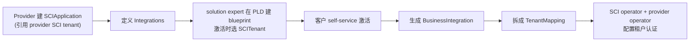

# SCI 身份与安全

> [!abstract] 核心
> **SAP Cloud Identity (SCI) Authentication service** 在 design-time 配置用户认证、系统到系统认证及(未来)授权。**SCI operator** 基于 [[Unified Resource Manager (URM)|URM]] + [[Unified Service Manager 与 ManagedService|USM]],自动 provision/配置 IAS(Identity Authentication Service)中的 SCI 应用。

## SCI 组成(SAP Cloud Identity Services)

| 组件 | 全称 | 作用 |
|------|------|------|
| **IAS** | Identity Authentication | 认证/SSO/用户管理/on-prem 集成、风险认证、2FA |
| **IPS** | Identity Provisioning | 身份生命周期 provision/deprovision |
| **IdDS** | Identity Directory | SCIM 2.0 REST API |
| **AMS** | Authorization Management | 基于 code Policy 的实例级授权(Node.js/Java 客户端库) |

> 未来将集成下一代 **AMS**。

## 能力

- **认证场景 design-time**:应用/服务身份、app-to-app 技术集成(含 principal propagation)、app-to-service。
- **授权场景**:未来 AMS 策略。

## 使用流程

## 关系

- SCI 也是 [[SPII 服务提供方集成接口|SPII]] **Facilitator**(自动建 IAS App-to-App ACL 依赖)。
- 服务于 [[Unified Service Manager 与 ManagedService|ManagedService]] 的 **Security capability**。

## App-to-App 模式

两个用 SCI 的服务间做用户传播/token 交换(经 USM 的 identity operator)。App2App 中 consumer 请求的 API 必须是 provider 暴露 API 的**子集**。

## 参考与指南

- 授权模型:[[授权模型 (Role-Binding-PathBinding)]]
- 系统角色:[[系统交付角色]]
- 操作:[[How-To 其他任务#Secure Your App 保护你的应用]]、[[How-To 集成你的应用#Facilitators]]

## 相关

- [[SPII 服务提供方集成接口]]
- [[数据保护与隐私]]
- [[业务场景总览#SCI Security 安全]]
