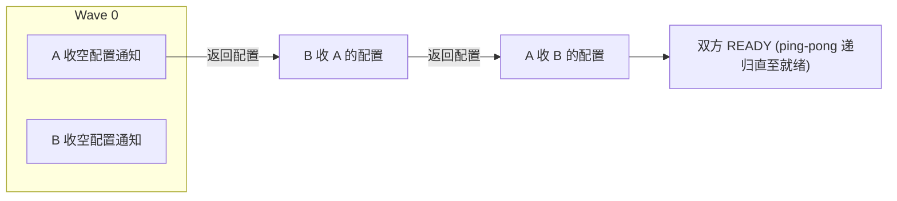

# SPII 服务提供方集成接口

> [!abstract] 核心
> **SPII (Service Provider Integration Interface)** 是应用提供方实现的**标准化 API**,用于自动化其与其他应用的集成。它同时适用于 IAS-based/mTLS-based **A2A**(Beyond Zones)和标准 **T2T**,也适用 customer-managed / SAP-managed。是 [[Unified Customer Landscape (UCL)|UCL]] 的**集成通知引擎**。

## 设计原则

- 客户只做**业务决策**。
- 每个 tenant mapping 都**通知**相关方。
- **递归配置传播**(recursive configuration propagation)。
- UCL 负责状态管理与 resync。
- 开放的 **Facilitators** 生态。

## Security 与交互模式

- **Security**:mTLS,信任 UCL client 证书,遵循 **`sap:cmp-mtls:v1`** access strategy。
- **交互模式**:Synchronous 或 Asynchronous(design time 选定,不可混用)。
- **版本**:推荐 SPII **v3**(`application_tenant_mapping:v3`,简化状态模型);v2 兼容但建议迁移。
- **Static SPII**:无代码、配置驱动的等价实现(UCL 托管),未配置则返回 READY 无配置(no-op)。

## SPII Engine Workflow(引擎工作流)

### Tenant mapping notifications
一个 tenant mapping 至少产生**两条对称通知**。术语:
- **receiverTenant**:被通知方
- **assignedTenant**:其对端

### 状态管理
UCL 维护每个 assignment 状态与整体聚合状态;Assign / Unassign 各有状态图。

## SPII Facilitators(协调器)

> [!tip] 什么是 Facilitator
> 可复用的**集成助手**,由"拥有该复用逻辑的服务方"实现,替应用提供方处理集成中的共性关注(如创建 Destination、Service Instance、SCI ACL)。是早期 **Opt-In Features** 的开放生态升级版。

**分类维度**:
- **Tenancy**:tenant-ful(如 SCI)/ tenant-less(如 BTP Destination Service)
- **Location**:PRE(前置拦截)/ POST(后置拦截)
- **Mode**:None / **Mutate**(JSON merge,推荐)/ Override(全量替换,仅向后兼容)
- **Sync/Async**

**通知负载**:Facilitator 契约含 3 段 —— `facilitatorTenant`、`receiverTenant`、`assignedTenant`(普通 provider 只有后两段)。

**常见 Facilitators**(详见 [[How-To 集成你的应用#Facilitators]]):
- SCI(身份/SSO/App2App)
- Service Manager(建 service instances)
- Connectivity(SAP Cloud Connector 访问 on-prem)
- Destinations(建 destinations/certificates)
- S/4HANA Cloud(建 Communication User/System/Arrangement)

## SPII 操作:Update / Reset

### Integration Update(集成更新)
新增 **`UPDATING`** 状态 + 4 个标准操作:`add`(新子集成)、`remove`、`modify`(非功能变更)、`rotate`(凭据轮换)。仅当集成处于完全 `READY` 时可发起。
- **Option 1(推荐)**:`PATCH /v1/formations/{uclFormationId}/assignments/{uclAssignmentId}`。
- **Option 2**:先改再通知。

### Integration Reset(集成重置)
无需拆除即重新初始化已建集成;复用现有 **`INITIAL`** 状态重放整个配置交换。触发:`PUT /v1/formations/{uclFormationId}/assignments/{uclAssignmentId}`(空 body)。

## 关键事实(FAQ 精选)

- 负载中**无 System Type / Formation Type**(会变、仅展示用);应改用稳定技术标识 **`applicationNamespace`** 和 **`uclFormationTypeId`**。
- `operationId` 唯一稳定,仅回传给 UCL 用于关联,**不得用于逻辑**。
- **异步状态上报 deadline 默认 1 小时(3600 秒)**;可用响应头 `X-Status-Report-Deadline-Seconds:<秒>` 覆盖。
- **交付保证是 "at least once"**(非 exactly once)—— 须**幂等**处理重复通知。
- 同步实现受 **BTP Cockpit 10 秒硬超时**约束。
- 用 `receiverTenant.uclAssignmentId` 作为唯一标识关联 artifacts。
- 决策基于 `context.operation` + `assignedTenant.configuration` + `receiverTenant.state`,**不要依赖 `assignedTenant.state`**。

## 相关

- [[Unified Customer Landscape (UCL)]]
- [[Formations 编排组]]
- [[How-To 集成你的应用]]
- [[SCI 身份与安全]]
