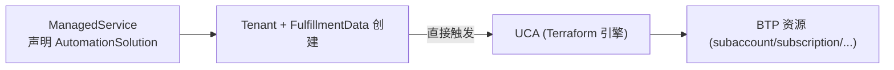

# Unified Cloud Automation (UCA)

> [!abstract] 核心
> **UCA** 简化 SAP BTP 资源 provisioning 的自动化。它基于 **SAP BTP Cloud Automation service**,是一个 **Terraform-as-a-service** 引擎,在 [[Unified Resource Manager (URM)|URM]] 中维护期望状态。支持 SAP-managed 与 customer-managed(对称,脚本可复用)。

## 关键特性

- 声明式、事务性(rollback)、幂等
- 追踪排障工具
- IaC / CI-CD 集成

## 支持的资源

Subaccount、Entitlement Assignment、Destination、Subscription、Service Instance、Environment Instance、Role Collection、IAS Trust Setup、IPS Configuration。

SAP-managed 额外插件式能力:**Suspension、Deprovisioning、SSO Setup(OIDC/SAML)**。

## 集成方式

作为 Unified Services 的 **leased operator**:service owner 在 `ManagedService` 中声明 `AutomationSolution`(`associatedWith` 关联 tenant 类型),tenant + `FulfillmentData` 创建时**直接触发 UCA(无需中间 SPFI)**。

触发来源:boosters、Marketplace、Discovery Center、custom code、URM 直连。

## Cloud Automation Designer (CAD)

**no-code/low-code 拖拽模板界面**,最多可降低 BTP 自动化编码/学习曲线约 **90%**(up to 90%),含监控排障视图。方案保存为 `AutomationSolution` 资源。详见 [[Workspace 与 CAD#CAD Cloud Automation Designer]]。

## 参考

资源(`AutomationSolution`、`AutomationRequest`、Modules)详情见 [[Cloud Automation 资源]]。

## 重要事实

- 凭据来自 **CIS**(SAP Cloud Management for SAP BTP)的 `cloud-automation` plan,存入 `Secret`。
- What's New:**2026-04-09 引入 UCA leased operator**,以直接 operator 驱动模型取代原 SPFI 组件与中间协议。

## 相关

- [[Unified Provisioning 供应]]
- [[Cloud Automation 资源]]
- [[Workspace 与 CAD]]
- [[Unified Resource Manager (URM)]]
