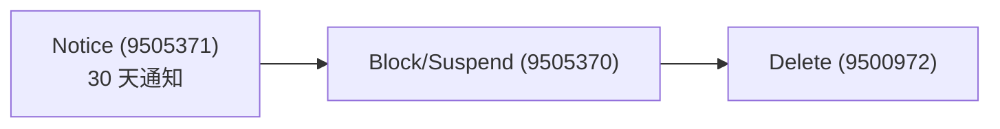

# Unified Commercial Integration (UCI)

> [!abstract] 核心
> **UCI** 是 Unified Services 在 **order-to-billing (O2B)** 流程中的编排角色,处理来自 CRM/SPC/EMS 的订单,把商业与合同信息映射到新的或已有客户,并管理客户组织(entitled / assigned / used 产品)的生命周期。

## 核心概念:Entitlement vs Eligibility

> [!important] 两个必须区分的概念
> - **Entitlement(权利)**:**商业实体**,授予客户在特定数量/条款下使用产品的许可,由 CRM/EMS 等受信系统管理。
> - **Eligibility(资格)**:**技术实体**,分配给客户 Organization,授予在组织内分发/使用产品的权限。
> - 一个 entitlement 可翻译为**一个或多个** eligibilities。
>
> 注:在参考手册中,`Eligibility` 已**取代**已弃用的 `Entitlement` 资源。见 [[商业化集成资源 (Eligibility 等)]] 与 [[已弃用资源]]。

**SLM**(Service Lifecycle Management)是 SAP 产品与 entitlement 的 single point of truth,也用于解析 product bundles。

## Entitlement 来源与标识

| 来源 | OrderSet 版本 | 说明 |
|------|--------------|------|
| EMS System Order | **OrderSet v2** | canonical lineItems |
| CRM System Order | **OrderSet v1** | 扁平字段 |
| Service Provider | — | `ServicePublishConfiguration` 的 path option |
| Contract Line Item | — | 仅 AI-Unit |

**OrderSet v3** 把 CRM/EMS/未来系统统一成单一 canonical 格式。

**Entitlement Tenant**:EMS/CRM 来源的 entitlement 应带 Entitlement Tenant + Installation ID(支持 support 渠道、终止、license 变更);service-provider 来源无此 tenant。

## Commercialization Events(Operation Types,关键数据)

| 编码 | 事件 |
|------|------|
| `9500970` | Tenant Setup |
| `9503677` | EU Data Protection Change(改 `euAccess` 标志) |
| `9503840` | License Product Change |
| `9503861` | Contract Date Change |
| `9505860` | CPIT change |
| `9503678` | End Customer Change |
| `9505371` | Notice Period(通知期,30 天) |
| `9505370` | Tenant Block(封锁/暂停) |
| `9505372` | Revoke Blocking |
| `9505390` | Revoke Blocking + License Change |
| `9500972` | Tenant Termination(删除) |
| `9507156` | Move to URM(从 SPC/CIS 一次性全自动迁移) |

## 终止流程 (Termination Flow)

为 GDPR 服务。**Down-sell** 不是 termination —— 客户须自行删实例,删完前被 block 新 provisioning。

**取消 OrderSet**:设 `Ready.Reason=Cancelled`,controller 跳过所有 reconciliation。

## 关系

UCI 把 [[Accounts 账户模型|Accounts]](Organization、eligibilities)与 [[Unified Provisioning 供应|Provisioning]](tenant 生命周期)连接起来。

## 相关

- [[商业化集成资源 (Eligibility 等)]]
- [[Accounts 账户模型]]
- [[业务场景总览]]
- [[How-To 其他任务#配置 Commercial Mapping]]
