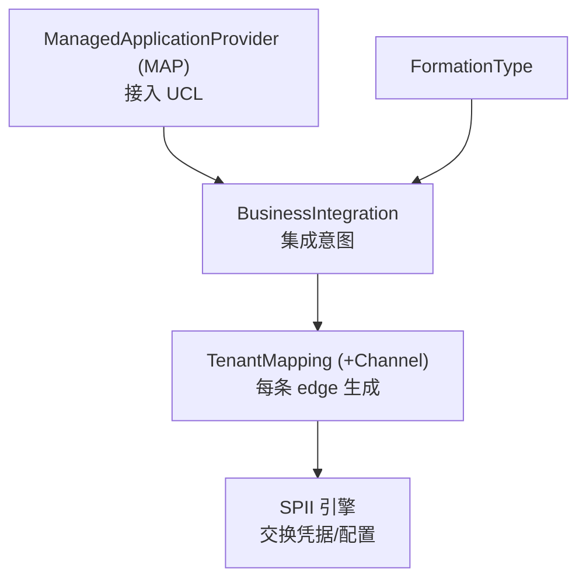

# Unified Customer Landscape (UCL)

> [!abstract] 核心
> **UCL** 把客户整个 IT landscape 信息自动聚合成一个**统一、机器可读、可扩展的图状(graph-like)landscape 模型**:节点 = application tenants,边 = integrations,节点元数据 = API/Event/Business Object/Capability。
>
> ⚠️ UCL **不参与 provisioning**,只在 tenant 被 provision 后做**发现(discovery)、集成(integrations)、ORD 元数据聚合**。

## 三大目标

1. **聚合/整合**客户 landscape 信息成统一图模型。
2. 通过 **GraphQL** 和 **OData** API **再暴露**供发现/内省。
3. 提供 **"managed by SAP"** 的集成生命周期管理(自动化 + day-2 运维如凭据轮换),让客户只做业务决策、不管技术接线。

## 接入 UCL:ManagedApplicationProvider (MAP)

应用通过 **`ManagedApplicationProvider (MAP)`** 资源 opt-in 接入 UCL,声明:tenant 来源(`tenantRegistry`)、是否暴露 [[ORD API 与发现|ORD]]、如何管理集成(含是否暴露 [[SPII 服务提供方集成接口|SPII]])。

> [!warning] 硬约束
> 一个 `ManagedService` 只能引用**一个** MAP。详见 [[Customer Landscape 资源 (MAP 等)]]。

## Discovery & Introspection(发现与内省)

提供覆盖整个客户 IT landscape 的整体 **observed state**。两个能力:

| 能力 | API | 说明 |
|------|-----|------|
| **UCL Discovery service** | **OData v4** | 暴露 tenant + ORD 元数据 + 经 BTP destinations 消费的集成;需以 **Runtime provider** 身份 onboard |
| **Unified Metadata Service (UMS)** | **GraphQL** | 基于 **Unified Landscape Model (ULM)**;消费者注册为 `MetadataConsumer`,按 Metadata Type 授权 |

### UMS 元数据服务
UMS 提供可插拔架构,各元数据类型 owner 提供 plugin 聚合/联邦数据(10+ 现有 aggregators),目标是开放生态。它是 UCL 图模型的底层元数据引擎。

## Integrations(集成)

基于 **Beyond Zones** paper,区分 business 与 technical integration:

- **Business Integration**(`BusinessIntegration` 资源):表达客户"把哪些 tenant 为某业务目的集成"的意图。
- **Technical Integration**:连通性信息(凭据及消费方式)。

两种维度分类:
- **Customer-Managed vs SAP-Managed**
- **Tenant-to-Tenant (T2T) vs App-to-App (A2A)**:
  - **T2T**:两租户间;凭据经 SPII 配置交换或 tenant mapping channels。
  - **A2A**:整应用间、tenant 无关、始终 SAP-managed;首个 tenant mapping 时"lazily"激活;大幅减少 point-to-point 凭据。

详见 [[Formations 编排组]] 与 [[SPII 服务提供方集成接口]]。

## 关键机制流程

## 参考与指南

- 资源详情:[[Customer Landscape 资源 (MAP 等)]]
- ORD:[[ORD API 与发现]]
- 集成引擎:[[SPII 服务提供方集成接口]]、[[Formations 编排组]]
- 操作:[[How-To 集成你的应用]]

## 相关

- [[Unified Resource Manager (URM)]]
- [[整体架构]]
- [[核心概念关系总览]]
