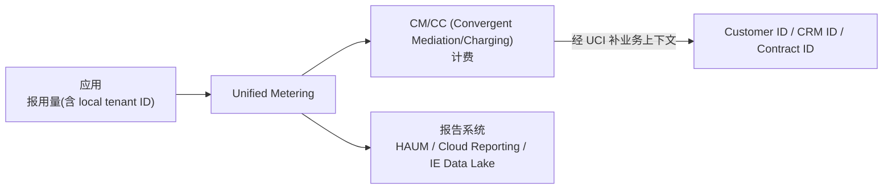

# Unified Metering 计量

> [!abstract] 核心
> **Unified Metering (UM)** 让服务记录用量信息。它作为一条**管道(pipeline)**,把 usage data 转发给 mediation/billing/reporting 系统,**本身无业务逻辑**。

## 用途

- consumption-based 商务模型计费:**CPEA、ICEA、C2C (Commit to Consume)**
- **Cloud Reporting** 报表与仪表盘
- license 合规(订阅制客户避免超用)
- 向客户展示用量信息
- 内部 SAP cross-charging(内部交叉计费)

## 关键机制与数据

- 灵活的 usage document schema,支持 **custom dimensions**。
- payload 含:`id`、`timestamp`、`consumer`、`measure(s)`、`customDimensions`。
- C2C 的 consumer 用 `originServiceInstance{id,type}`。
- BTP 场景用 `consumer.btp{environment, subAccount}` + `product.service{id,plan}`。

> [!warning] 隐私
> dimension(维度)**不得含个人数据**。

## 对比 SAP BTP Metering Service

| 维度 | Unified Metering | SAP BTP Metering |
|------|------------------|------------------|
| 覆盖 BTP 场景 | ✅ 全部 | 部分 |
| Commit to Consume (C2C) | ✅ **唯一支持** | ❌ |
| 认证 | **mTLS**(SAP 最佳实践) | XSUAA / OAuth |

C2C 要求所有云产品用 Unified Metering 自计量。

## 计量流程与 Account 资源

- 服务先 provision 一个计量 **`Account`** 资源(`metering.cloud.sap.com/v1`),Ready 后自动生成含端点与证书的 `Secret`(证书 3 个月有效)。
- 详见 [[计量资源]] 与 How-To [[How-To 其他任务#Meter Your App 计量你的应用]]。

## Usage Reporting Flow

## 相关

- [[计量资源]]
- [[业务场景总览#Billing and Reporting 计费与报告]]
- [[How-To 其他任务#配置 Commercial Mapping]]
