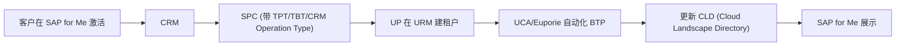

# Unified Provisioning 供应

> [!abstract] 核心
> **Unified Provisioning (UP)** 是 Unified Services 的供应能力。三大原则:**Model-driven**(用 blueprint 建模)、**Desired-state-driven**(客户在 SAP for Me 触发 → URM 建期望状态 → operator 协调)、**API-driven**(用 **SPFI**)。

## 两大供应方式

| 方式 | 说明 |
|------|------|
| **SPC classic** | 在 Service Provider Cockpit 里模块化 service definitions;用 **PLD** blueprint + **BoM resolution service** 决定顺序 |
| **Unified Provisioning (UP)** | 把编排放到 [[Unified Resource Manager (URM)\|URM]](期望状态仓库)+ operators;同样用 BoM resolution + PLD blueprints |

两者的 fulfillment trigger 都来自 CRM/EMS 经 SPC。

## 现状(CIS / SPC)

- **CIS (Commercial Infrastructure Services)**:面向 BTP customer-managed PaaS,产品配置用 [[Unified Cloud Automation (UCA)|UCA]] 自动化。
- **SPC (Service Provider Cockpit)**:面向 SaaS-like,用 ABAP provisioning 过程。

### SaaS 供应流程

## 关键组件

- **SPFI** — Service Provider Fulfillment Interface(见下)
- **PLD** — [[附录-PLD 产品景观设计器|Product Landscape Designer]]
- **SPC** — Service Provider Cockpit

## SPFI(Service Provider Fulfillment Interface)

标准化 REST API,让 SAP 的 operator 统一触发 SaaS provider 的技术 fulfillment(tenant provision/update/delete),解耦 operator 与具体实现。

### SPFI V2(推荐)
- **单向通信**(Tenant Operator 主动调用,provider 不回调)
- **异步为主** + **Retry-After 拉取式状态更新**
- **mTLS**(operator 出站带 client 证书)
- **幂等激活**(同 `sapId` 重复创建返回 409 + 现有 status URL)
- 标准操作:Provision / Update / Get / Get Status / Update State / Delete Tenant
- **Tenant States**:In Update/Activation/Blocking/Deletion、Active、Blocked、In Self-Recoverable Error、In Recoverable Error、Final Error

> SPFI V1 已弃用(双向 Notify→Resolve→Update、OAuth 2.0),被指低效耦合、认证脆弱。

### Data Retention(隐私)
日志与资源级数据 30 天保留;终止时 1 周宽限后触发 termination(GDPR 合规)。

## Content Provisioning(内容配置)

把 content entities 当作 desired-state 资源(在 `BTP Blueprint` 或 `ManagedService` 中定义),由 **Content Operator** 部署到 content runtime tenant,用 **SPCI (Service Provider Content Interface)**。

关键资源:`ContentPackage`(RTD)、`ContentRuntime`、`ContentPackageConfig`、`ContentTrigger`。
SPCI 关键端点:`POST /v1/files`、`POST /v1/contentPackages`、`GET /v1/contentPackages/{id}/status`。

## BTP Apps 供应自动化

- **SAP-Managed**(按 INTG-TG04):推荐用 **UCA as leased operator**,声明 `AutomationSolution` 资源。
- **Customer-Managed**:基于 BTP **Cockpit boosters** + UCA。

## 参考与指南

- 资源详情:[[供应资源 (SPFI-FulfillmentData-Solution)]]
- 蓝图:[[BTP Blueprint 与解决方案]]
- 操作:[[How-To 供应与迁移到 URM]]

## 相关

- [[Unified Resource Manager (URM)]]
- [[Unified Cloud Automation (UCA)]]
- [[基本原理 (Fundamentals)]]
- [[入门-分阶段开发 (Staged Development)]]
