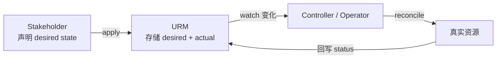

# Unified Resource Manager (URM)

> [!abstract] 核心
> URM 是管理 SAP 云资源的**中心化服务**,采用 **Kubernetes 风格的声明式 desired-state 模型**。SAP 团队/伙伴/客户在此登记资源并声明"期望状态(desired state)",service provider 观测该状态并采取动作达成它。URM 是整个 [[什么是 Unified Services|Unified Services]] 生态的**地基**,也是 desired state 与 status 的 **single source of truth**。

## 关键机制

- **Resource Types**:由 `group` + `version` + `type`(合称 **GVT**)唯一标识;资源以 `nodes` 组成的层级结构存储。
- **Resource Type Definitions (RTDs)**:定义资源 schema 的资源,创建/更新时用于校验。支持 **Nested RTD**(局部注册,仅在其注册路径可见)。详见 [[系统资源 (TechnicalClient-Secret-RTD)]]。
- **Declarative API**:声明一次期望状态即自动协调。
- **Custom Resource Extensions**、加密与安全、事件与状态管理(Supportability)。
- URM 是**最终一致(eventually consistent)**系统。

## 声明式协调模型

核心:URM 中心化管理资源及其状态(desired 和 actual)。控制器 watch 变化并把真实世界向 desired state 收敛;控制器可在其协调循环中声明(并 watch)其他 API server 资源。

## REST API 与认证

- HTTP RESTful 接口,对已注册资源类型支持完整 **CRUD**,可订阅资源状态变更。
- **认证基于 mTLS**。
- 端点结构:`/api/resources/<group>/<version>/<plural-type>/<path>/.../<resource>`。
- 详见 [[其他工具与 SDK#rm-api]]。

## 约束(重要事实)

- 资源 `metadata.name` 上限 **63 字符**。
- 单个资源大小上限 **512 KB**(超出返回 413)。
- 全路径(`path` + `/` + `name`)**≤ 64 字符**。
- 删除依赖 **finalizers**,可能耗时数小时;卡住时按 finalizer 前缀开工单。

## 工具生态

- [[uctl 命令行工具]] — 命令行
- [[Workspace 与 CAD|Unified Services Workspace]] — Web UI
- [[其他工具与 SDK#Helm Plugin|Helm plugin]] — 部署编排
- [[其他工具与 SDK#Secret Provider|Secrets Provider]] — 把 Secret 挂成 K8s volume
- [[Ubuilder 脚手架|Ubuilder]] — 用 RTD 构建 URM API 的框架
- [[URM Studio (VS Code 扩展)|URM Studio]] — VS Code 建模扩展

## URM 作为 Fulfillment Control Plane

面向 **SAP-managed SaaS 应用/应用套件**的所有者,让 app 的 provisioning 通过 Unified Services 自动化。**URM-based provisioning** 特性:

- 完全 **self-service**(客户在 SAP for Me 随时触发,与下单时间无关)
- **Blueprint-driven**
- **desired-state-driven**
- 对 SAP-managed 与 customer-managed 两种模式**对称**

## 组件基于 URM

以下核心组件都是 URM operator:
- [[Unified Service Manager 与 ManagedService|USM]]
- [[Unified Commercial Integration (UCI)|UCI]]
- [[Accounts 账户模型|Unified Account]]
- [[Unified Cloud Automation (UCA)|UCA]]
- [[Unified Provisioning 供应|UP]]
- [[Unified Customer Landscape (UCL)|UCL]]
- [[Unified Metering 计量|UM]]

## 相关

- [[整体架构]]
- [[资源模型通用约定]]
- [[核心概念关系总览]]
- [[开发-为你的应用开发 Operator]]
