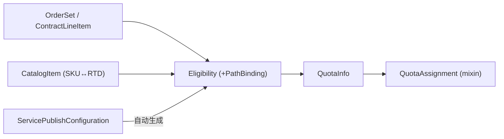

# 商业化集成资源 (Eligibility 等)

> API group:`accounts.commercial.resource.api.sap`(部分策略在 `hierarchy.policies.resource.api.sap/v1`)。概念背景见 [[Unified Commercial Integration (UCI)]]。

## 核心链路

## Eligibility ⭐(资格核心)

- API group **`hierarchy.policies.resource.api.sap/v1`**,hierarchy-mode 策略。**取代已弃用的 `Entitlement`**(见 [[已弃用资源]])。
- 由客户订单自动生成(前提是相关 `ServicePublishConfiguration` 有定义),或由 `ServicePublishConfiguration` 直接触发;通常建在客户 `Organization` 层,**对 org admin 只读**。
- 被 **`PathBinding`** 引用;**恒 `recursive: true`**。一个 `Eligibility` 只针对一个 managed service / 一个资源类型;可被多个 `PathBinding` 引用;两者须同 `Organization`,`PathBinding` 在 `Eligibility` 同 path 或下游。
- 删除时级联删除对应 `PathBinding` 与 `QuotaInfo`(除非仍有 `QuotaAssignment` 或配额被共享)。
- `spec.rules[*].parameters`:`actions`、`apiGroup`、`type`、`source[*].{materialNumber(SKU), origin(∈CRM/CRM-ContractLineItem/ServiceProvider/EMS), quantity, calculatedQuotaAmount, installationNumber, entitlementSetId, entitlementTenantId, lastOrderOperationType, tenantProductType}`。

## ServicePublishConfiguration (v2) ⭐

- 服务商发布 managed service 供他人消费;须与 MS 同路径。**创建时自动生成 `Eligibility` + `PathBinding`**(继而触发 `QuotaInfo`),删除时自动删除;撤销消费权限须手动删 `PathBinding`。
- `spec`:`managedServiceName`;`assignmentRule.{organizationSelectors, pathSelectors}`;`entitlementTenants[*].tenantProductType`;`entitlementConfiguration[*]`(应用级:`groupType`、`quotaDefinition`、`paths[*]`(SAP 内部流)、`products[*]`(商业流)、`subscribedOperationTypes`);套件级 `sharedQuotaDefinition[*]`;`eligibilityConditions[*]`(按客户灰度)。

## ServiceMetadata (v2) ⭐

- `ManagedService` 的 provider resource,**与 MS 一对一**;在 **SLM** 注册服务、支撑 billing 与 functional metering。
- 含 `commercialMappingConfigurations[*].{applicableTo.{billing,reporting}, tenantProductType, cldSystemRole, localTenantType, localTenantIdPattern, groupType}`、`products[*].commercialConfigurations.{callOffType(Consumption/Check-Out), commercialType(Subscription/PPAYG/Cloud Credits/Free), customerType(External/Partner)}`、`productSuite.{name, tenantProductType}`。

## OrderSet(三个版本)

| 版本 | 对接 | 关键字段 |
|------|------|---------|
| **v1** | SAP CRM | 扁平字段 `saleType`/`crmId`/`entitlementSetId`/`crmTenantId` |
| **v2** | EMS | canonical `lineItems`、`customerId`/`origin`/`leadingEntitlementNumber` |
| **v3** | 统一 canonical | `request`/`tenant`/`dataCenter`/`entitlement`/`phase`,按 `entitlementSetId` 分组管 Eligibility |

**终止流程 operationType**:Notice `9505371`、Block `9505370`、Revoke Block `9505372`、Revoke+License Change `9505390`、Termination `9500972`。见 [[Unified Commercial Integration (UCI)#Commercialization Events Operation Types 关键数据]]。

## 其他商业化资源

- **`CatalogItem` (v2)**:`groupType` ↔ `materialNumber` 映射;含 `servicePublishConfigurationRef`、`quotaAmountExpression`(CEL)。
- **`ContractLineItem`**(SAP CRM 独占):`customerId`/`contractId`/`lineItemId`/`itemType`(ProductEntitlement/ProductActivation)。
- **`ProductBundle`**、**`EntitlementTenant`**、**`QuotaInfo`**(只读自动生成)、**`QuotaAssignment`**(mixin,只读)、**`ServiceInstanceInfo` (v2)**(为新 `TenantData` 生成 commercial mapping)。
- **API Extensions**:Eligibility Check、Entitlement Check、Account Entitlement List、Account Eligibilities、Account Quotas、Order Info。

## 相关

- [[Unified Commercial Integration (UCI)]]
- [[ManagedService v2 参考]]
- [[已弃用资源]]
- [[How-To 其他任务#配置 Commercial Mapping]]
