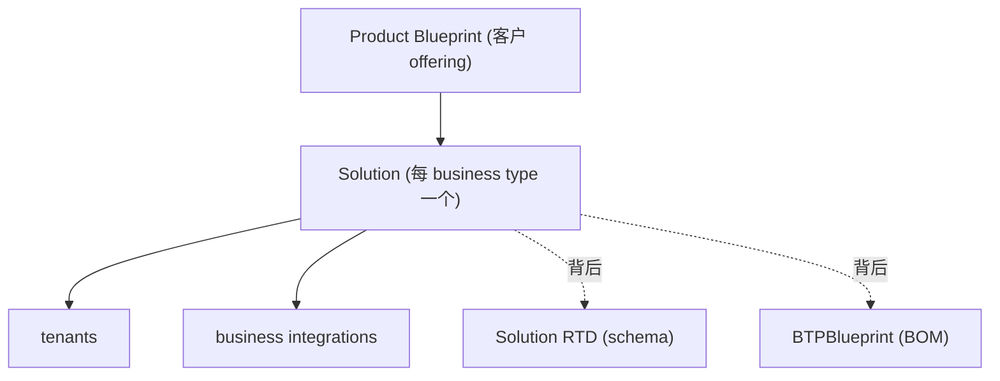

# How-To:供应你的应用 & 迁移到 URM

> [!abstract]
> 用 URM-based provisioning 自动化应用供应,以及把 brownfield(存量)应用从 SPC/UP/CIS 迁移到 URM。所有 SAP app 应为 **SAP-managed + URM-based**。

## 供应建模层级

- **Product Blueprint 模式**:#1 单一 `BTPBlueprint`/business type(最常见,支持 shared services);#2 每 app 一个(不支持 embedded shared tenant)。
- **Provisioner 选择**:[[Unified Cloud Automation (UCA)|UCA]] / Custom Operator(Ubuilder)/ SPC SPFI / 自实现 SPFI。

## 供应 SAP-Managed SaaS App(核心流程)

1. **App 级 onboarding**:跑向导 → 导入 [[URM Studio (VS Code 扩展)|URM Studio]] → 增强 Tenant RTD → 建 `AutomationSolution`(CAD)/Operator/SPFI → 支持合同终止(Block/Unblock/Terminate)→ 增强 `ServiceMetadata` → 发布 tenant type → onboard CLD → Canary **level-0** 测 → 设 staged development → 设 [[UPC 统一提供方驾驶舱|UPC]] 排障。
2. **Product Blueprint 级 onboarding**:向导建 blueprint 资源 → 商务化(SKU/TPT/system role,TPT 配 "Provisioning Scenario"="URM")→ 定义 Solution schema → 配 `BTPBlueprint`(`tenants[]` 的 GVT + `setupMode` + `specTemplate` 用 `.BTPSOLUTION`)→ 发布 → onboard ODS → 测试。
3. **SAP for Me 测试**:有 SKU 后必须用 customer order 验证(Live onboarding 前提)。
4. **Live onboarding**:重开工单建 Live provider folder(勿覆盖 Canary)→ **RTD 审批**(克隆 Jira `SAPBTPCFSSR-40`,SLA 5 天)→ GA 加 IAS tenant allowlist → Live level-0。

## 供应 Customer-Managed BTP PaaS App

> [!warning] Unified Services Booster 已废弃(INTG-04R1 要求转 SAP-managed)。

流程:向导选 Customer-managed → CAD 建/测 `AutomationSolution` → 建 Solution RTD(含 `BTPSolution` mixin)→ 建 `BTPBlueprint` → 请 URM 授 solution type 权限 → 建 Unified Services Booster(需 CAM 权限)。

## Move to URM(Brownfield 迁移)

> **"Move to URM" CRM operation type 仅用于同一 app 的编排迁移**;变 suite 一部分时不能用。

| 选项 | 说明 | 适用 |
|------|------|------|
| **Option 1 Side-by-Side**(推荐) | 新旧租户并存、客户驱动分阶段 | 功能未对齐/客户少(<100)/需客户决策/差异大 |
| **Option 2 Fully Automated**("Move to URM") | 一次性全自动、立即切换 | 仅新旧功能与设置**完全一致**时 |

### 三个迁移场景
- **SPC 场景**:实现 transition endpoint(SPC 收到 CRM "Move to URM" 时对每 tenant 调用),建 ResourceGroup + solution + `BTPSolution`(含 `entitlementTenantId` + `linkedTenants`)。
- **UP/PLD 场景**:**尚未支持**;从最新 formation-aware PLD blueprint 迁。
- **CIS 场景**:新建 SAP-managed 租户替换 customer-managed 租户,**需客户同意**;有 GVT 则复用同 Group+Type、不同 version。

## 相关

- [[Unified Provisioning 供应]]
- [[供应资源 (SPFI-FulfillmentData-Solution)]]
- [[BTP Blueprint 与解决方案]]
- [[入门-分阶段开发 (Staged Development)]]
