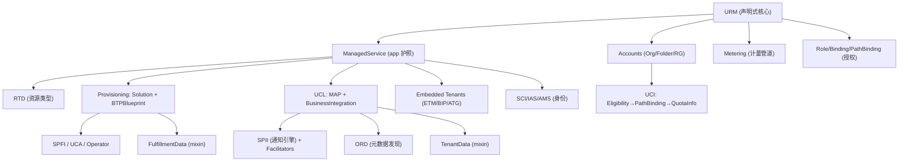

# 核心概念关系总览

> [!abstract]
> 用一张图 + 分组说明,把 Unified Services 全部资源/组件如何串起来讲清楚。

## 全景关系图



## 分组说明

- **地基**:[[Unified Resource Manager (URM)|URM]] = desired-state 仓库 + RTD 模型,承载一切。
- **应用护照**:[[Unified Service Manager 与 ManagedService|ManagedService]] 声明 Commercialization / Provisioning / Integration / Metering / Security 五大 capability。
- **账户与商务**:[[Accounts 账户模型|Accounts]](Organization/Folder/ResourceGroup)承载 [[Unified Commercial Integration (UCI)|UCI]] 的 entitlement → eligibility → quota。
- **供应**:[[Unified Provisioning 供应|UP]] 用 PLD blueprint + BoM resolution + SPFI/UCA/custom operator 把 solution 分解为 tenants/integrations/content 落到 URM。
- **客户全景**:[[Unified Customer Landscape (UCL)|UCL]] 聚合 landscape(图模型),经 Discovery/UMS 暴露;用 [[ORD API 与发现|ORD]] 发现元数据;用 [[Formations 编排组|Formations]] 驱动 Business/Technical Integration;底层通知契约是 [[SPII 服务提供方集成接口|SPII]](含 Facilitators/Update/Reset)。
- **嵌入式租户**:[[Embedded Tenants 嵌入式租户|Embedded Tenants]](ETM/BIP/ATG/Blueprint)由 UCL 编排集成。
- **计量**:[[Unified Metering 计量|Metering]] 是独立计量管道,服务 C2C/CPEA/ICEA 计费与 Cloud Reporting。
- **身份**:[[SCI 身份与安全|SCI/IAS/AMS]] 提供身份与授权,SCI 亦作 SPII Facilitator。

## 端到端贯穿(商务 → 技术)

```
CRM/EMS/SPC → OrderSet(v1/v2/v3) → entitlement/eligibility (URM)
  → SAP for Me 触发 → UP provision → UCL 集成 → Metering 计费
  → Termination(9505371 → 9505370 → 9500972) 清理 (GDPR)
```

## 相关

- [[00-索引 Home]]
- [[整体架构]]
- [[术语表与缩写]]
